# API Diagrams (Mermaid)

This file contains API-focused class diagrams and additional sequence diagrams for important endpoints and flows.

---

## API class diagram

```mermaid
classDiagram
    class LoginApi { +POST /api/login }
    class RegisterApi { +POST /api/register }
    class NewTokenApi { +POST /api/auth/refresh }
    class LogoutApi { +POST /api/logout }
    class TransactionsApi { +CRUD /api/transactions }
    class SubscriptionsApi { +GET /api/subscriptions }
    class BudgetsApi { +CRUD /api/budgets }
    class CategoriesApi { +CRUD /api/categories }
    class UserApi { +GET /api/user\n+    +PUT /api/user }
    class ReportsApi { +GET /api/reports/budgets }
    class SpentThisMonthApi { +GET /api/spent-last-month }
    class JwtService
    class IEmailService
    class BudgetHelpers
    class FinancetrackerContext

    LoginApi ..> FinancetrackerContext : reads Users
    RegisterApi ..> FinancetrackerContext : writes Users
    NewTokenApi ..> JwtService : validate/issue tokens
    TransactionsApi ..> FinancetrackerContext : reads/writes Transactions/Categories/Subscriptions
    TransactionsApi ..> IEmailService : NotifyBudgetsForTransactionAsync
    BudgetsApi ..> BudgetHelpers : NormalizeRangeForResponse/ValidateCategoryExists
    ReportsApi ..> ReportService : GenerateBudgetReportPdfAsync

```

---

## Additional sequence diagrams

### Register (POST /api/register)

### Refresh token (POST /api/auth/refresh)

### Add budget (POST /api/budgets)

### Update transaction (PUT /api/transactions/{id})

### Delete transaction (DELETE /api/transactions/{id})

### Get paged transactions (GET /api/transactions/paged)

### Update current user (PUT /api/user)

### Category CRUD (POST/GET/PUT/DELETE /api/categories)

### Get subscriptions (GET /api/subscriptions)

### Generate report (GET /api/reports/budgets)

### Spent this month (GET /api/spent-last-month)

---

Generated on 2025-11-03
