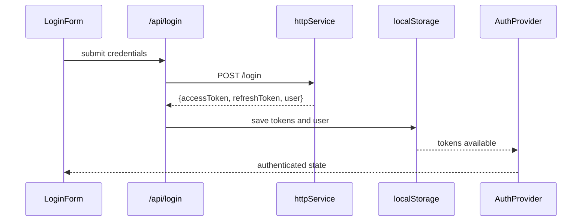

# Auth API flows (frontend)

```mermaid
sequenceDiagram
    participant UI as LoginForm
    participant AuthApi as /api/login
    participant Http as httpService
    participant Storage as localStorage
    participant App as AuthProvider

    UI->>AuthApi: submit credentials
    AuthApi->>Http: POST /login
    Http-->>AuthApi: {accessToken, refreshToken, user}
    AuthApi->>Storage: save tokens and user
    Storage-->>App: tokens available
    App-->>UI: authenticated state

```
