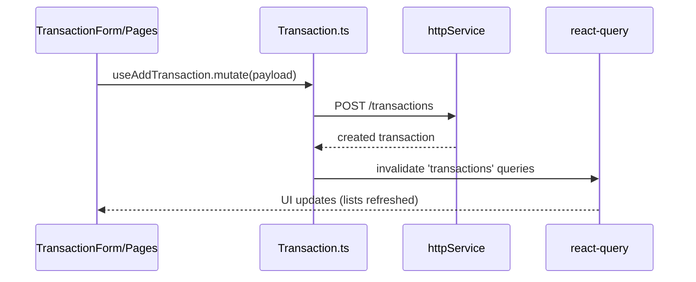

# Transaction API flows (frontend)

```mermaid
sequenceDiagram
    participant UI as TransactionForm/Pages
    participant ApiModule as Transaction.ts
    participant Http as httpService
    participant Query as react-query

    UI->>ApiModule: useAddTransaction.mutate(payload)
    ApiModule->>Http: POST /transactions
    Http-->>ApiModule: created transaction
    ApiModule->>Query: invalidate 'transactions' queries
    Query-->>UI: UI updates (lists refreshed)

```
