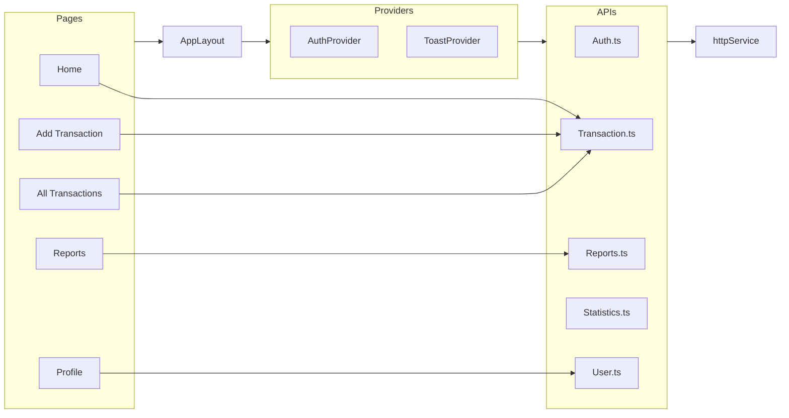
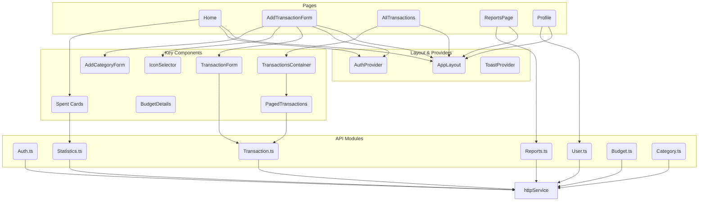

# Frontend components full relation diagram

# Frontend components full relation diagram

Notes:

- High-level, inferred relations generated from file names in `frontend/src`.
- This file offers two diagrams: a compact Overview (for quick orientation) and a Detailed view (grouped and simplified) for deeper reading.
- If you want exact, import-accurate edges I can parse the source files and update edges.

## Overview (compact)

## Detailed (grouped & simplified)

---

If this looks good I can:

- Parse `frontend/src` imports to produce exact edges and update this diagram automatically.
- Split the detailed diagram into per-page files for very large projects.
