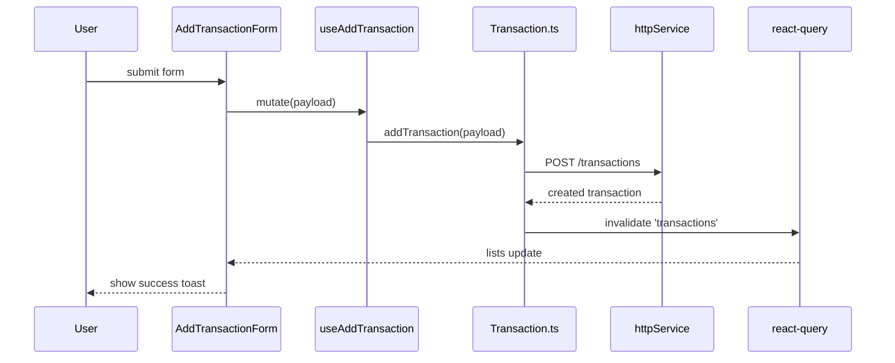

# Create transaction flow (frontend)

```mermaid
sequenceDiagram
    participant User as User
    participant Form as AddTransactionForm
    participant Hooks as useAddTransaction
    participant Api as Transaction.ts
    participant Http as httpService
    participant Query as react-query

    User->>Form: submit form
    Form->>Hooks: mutate(payload)
    Hooks->>Api: addTransaction(payload)
    Api->>Http: POST /transactions
    Http-->>Api: created transaction
    Api->>Query: invalidate 'transactions'
    Query-->>Form: lists update
    Form-->>User: show success toast

```
