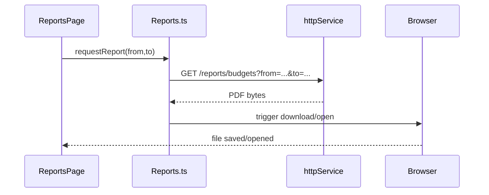

# Generate report flow (frontend)

```mermaid
sequenceDiagram
    participant UI as ReportsPage
    participant Api as Reports.ts
    participant Http as httpService
    participant File as Browser

    UI->>Api: requestReport(from,to)
    Api->>Http: GET /reports/budgets?from=...&to=...
    Http-->>Api: PDF bytes
    Api->>File: trigger download/open
    File-->>UI: file saved/opened

```
