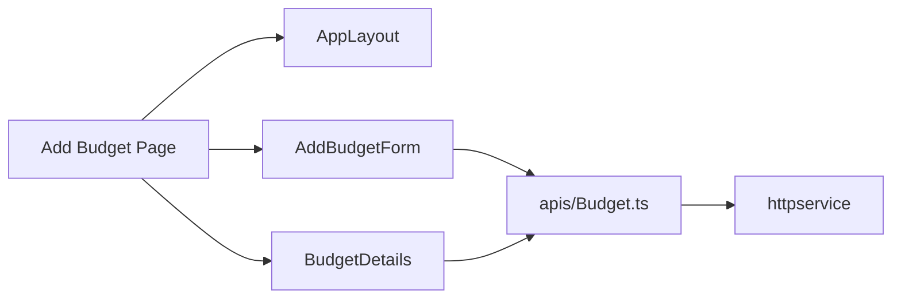

# Add Budget — Relations

Relations for the Add Budget page.

```mermaid
flowchart LR
  AddBudget[Add Budget Page]
  AppLayout[AppLayout]
  AddBudgetForm[AddBudgetForm]
  BudgetDetails[BudgetDetails]
  BudgetAPI[apis/Budget.ts]
  Http[httpservice]

  AddBudget --> AppLayout
  AddBudget --> AddBudgetForm
  AddBudget --> BudgetDetails

  AddBudgetForm --> BudgetAPI
  BudgetDetails --> BudgetAPI

  BudgetAPI --> Http
```
