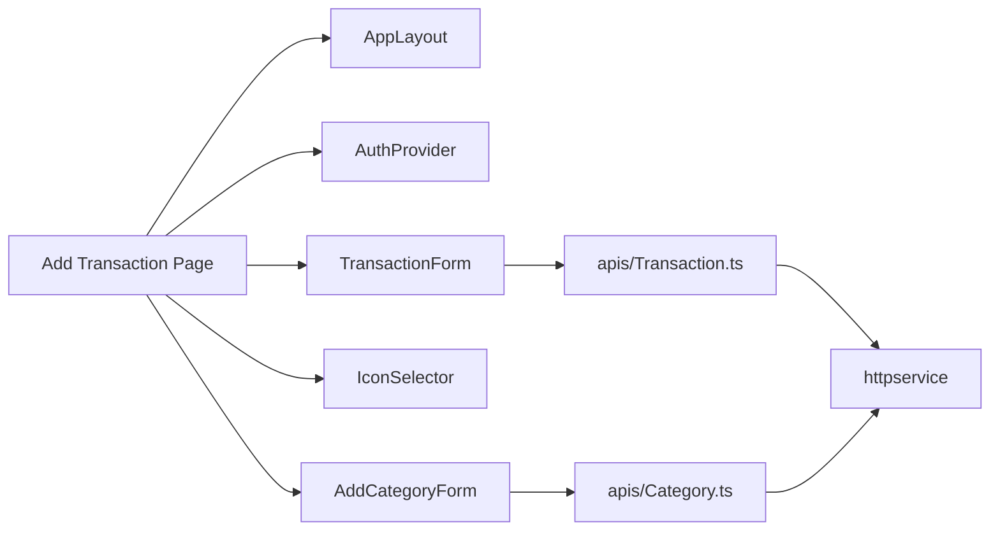

# Add Transaction — Relations

# Add Transaction — Relations

Diagram shows relations for the Add Transaction UI.

```mermaid
flowchart LR
  AddTx[Add Transaction Page]
  AppLayout[AppLayout]
  AuthP[AuthProvider]
  TransactionForm[TransactionForm]
  IconSelector[IconSelector]
  AddCategoryForm[AddCategoryForm]
  TxAPI[apis/Transaction.ts]
  CategoryAPI[apis/Category.ts]
  Http[httpservice]

  AddTx --> AppLayout
  AddTx --> AuthP
  AddTx --> TransactionForm
  AddTx --> IconSelector
  AddTx --> AddCategoryForm

  TransactionForm --> TxAPI
  AddCategoryForm --> CategoryAPI

  TxAPI --> Http
  CategoryAPI --> Http
```

classDef comp fill:#fff8e6,stroke:#333
