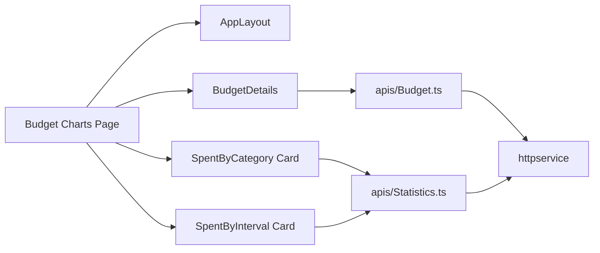

# Budget Charts — Relations

Relations for the Budget Charts / Budget overview page.

```mermaid
flowchart LR
  BudgetCharts[Budget Charts Page]
  AppLayout[AppLayout]
  BudgetDetails[BudgetDetails]
  SpentByCategory[SpentByCategory Card]
  SpentByInterval[SpentByInterval Card]
  BudgetAPI[apis/Budget.ts]
  StatsAPI[apis/Statistics.ts]
  Http[httpservice]

  BudgetCharts --> AppLayout
  BudgetCharts --> BudgetDetails
  BudgetCharts --> SpentByCategory
  BudgetCharts --> SpentByInterval

  BudgetDetails --> BudgetAPI
  SpentByCategory --> StatsAPI
  SpentByInterval --> StatsAPI

  BudgetAPI --> Http
  StatsAPI --> Http
```
