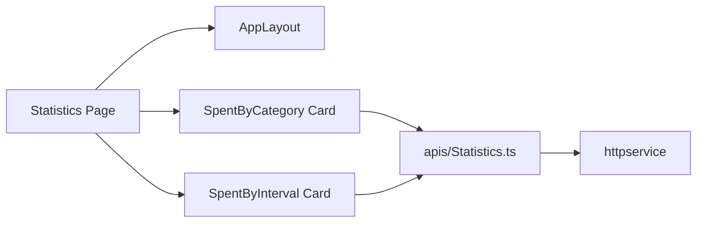

# Statistics Page — Relations

Relations for the Statistics page (spent by category / interval, etc.).

```mermaid
flowchart LR
  Statistics[Statistics Page]
  AppLayout[AppLayout]
  SpentByCategory[SpentByCategory Card]
  SpentByInterval[SpentByInterval Card]
  StatsAPI[apis/Statistics.ts]
  Http[httpservice]

  Statistics --> AppLayout
  Statistics --> SpentByCategory
  Statistics --> SpentByInterval

  SpentByCategory --> StatsAPI
  SpentByInterval --> StatsAPI

  StatsAPI --> Http
```
