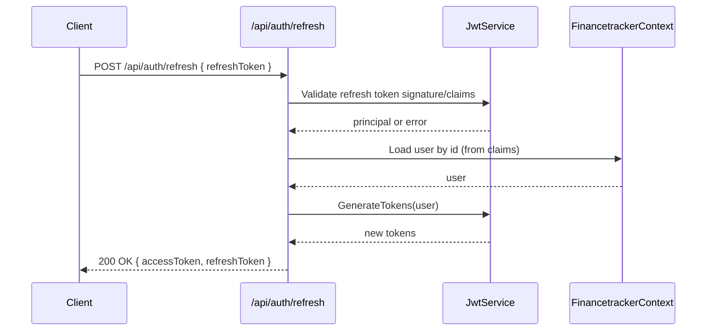

# Refresh token sequence

```mermaid
sequenceDiagram
    participant Client
    participant API as /api/auth/refresh
    participant Jwt as JwtService
    participant Db as FinancetrackerContext

    Client->>API: POST /api/auth/refresh { refreshToken }
    API->>Jwt: Validate refresh token signature/claims
    Jwt-->>API: principal or error
    API->>Db: Load user by id (from claims)
    Db-->>API: user
    API->>Jwt: GenerateTokens(user)
    Jwt-->>API: new tokens
    API-->>Client: 200 OK { accessToken, refreshToken }

```
