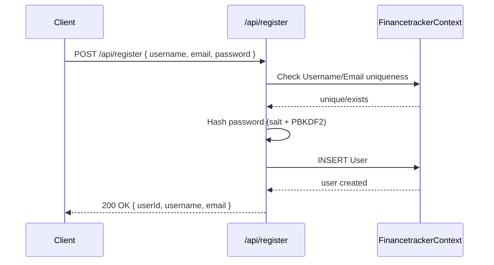

# Register sequence

```mermaid
sequenceDiagram
    participant Client
    participant API as /api/register
    participant Db as FinancetrackerContext

    Client->>API: POST /api/register { username, email, password }
    API->>Db: Check Username/Email uniqueness
    Db-->>API: unique/exists
    API->>API: Hash password (salt + PBKDF2)
    API->>Db: INSERT User
    Db-->>API: user created
    API-->>Client: 200 OK { userId, username, email }

```
