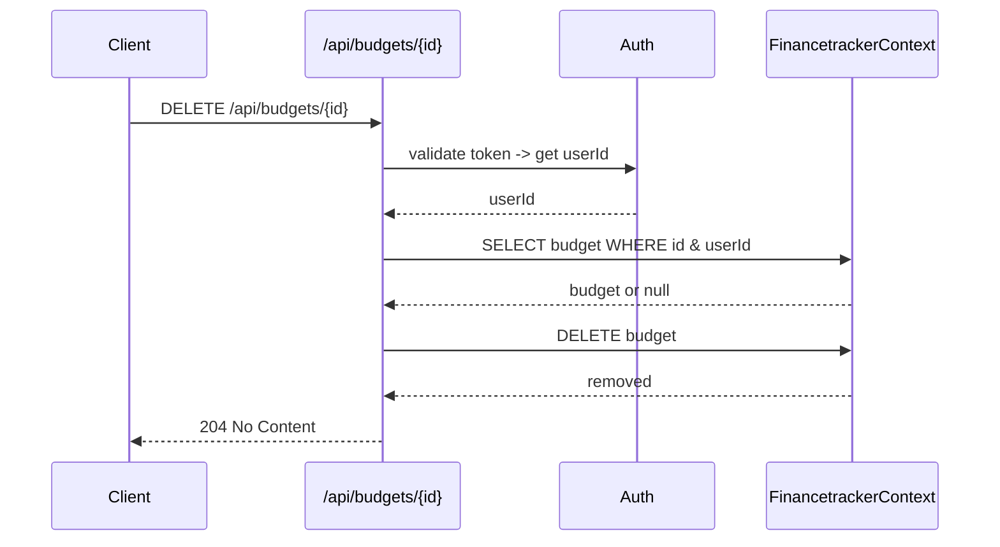

# Delete budget sequence

```mermaid
sequenceDiagram
    participant Client
    participant API as /api/budgets/{id}
    participant Auth
    participant Db as FinancetrackerContext

    Client->>API: DELETE /api/budgets/{id}
    API->>Auth: validate token -> get userId
    Auth-->>API: userId
    API->>Db: SELECT budget WHERE id & userId
    Db-->>API: budget or null
    API->>Db: DELETE budget
    Db-->>API: removed
    API-->>Client: 204 No Content

```
