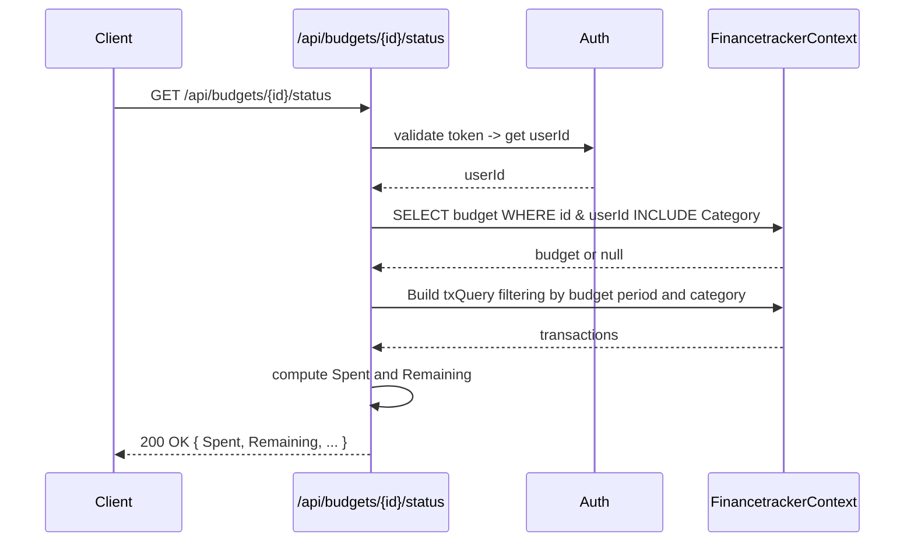

# Get budget status sequence

```mermaid
sequenceDiagram
    participant Client
    participant API as /api/budgets/{id}/status
    participant Auth
    participant Db as FinancetrackerContext

    Client->>API: GET /api/budgets/{id}/status
    API->>Auth: validate token -> get userId
    Auth-->>API: userId
    API->>Db: SELECT budget WHERE id & userId INCLUDE Category
    Db-->>API: budget or null
    API->>Db: Build txQuery filtering by budget period and category
    Db-->>API: transactions
    API->>API: compute Spent and Remaining
    API-->>Client: 200 OK { Spent, Remaining, ... }

```
