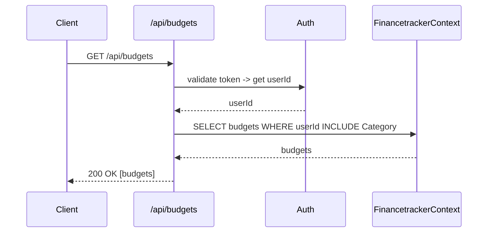

# Get budgets sequence

```mermaid
sequenceDiagram
    participant Client
    participant API as /api/budgets
    participant Auth
    participant Db as FinancetrackerContext

    Client->>API: GET /api/budgets
    API->>Auth: validate token -> get userId
    Auth-->>API: userId
    API->>Db: SELECT budgets WHERE userId INCLUDE Category
    Db-->>API: budgets
    API-->>Client: 200 OK [budgets]

```
