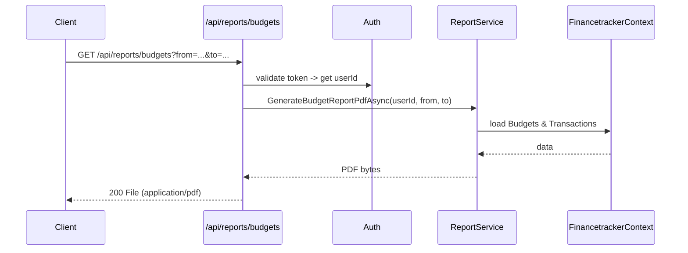

# Generate report sequence

```mermaid
sequenceDiagram
    participant Client
    participant API as /api/reports/budgets
    participant Auth
    participant Report as ReportService
    participant Db as FinancetrackerContext

    Client->>API: GET /api/reports/budgets?from=...&to=...
    API->>Auth: validate token -> get userId
    API->>Report: GenerateBudgetReportPdfAsync(userId, from, to)
    Report->>Db: load Budgets & Transactions
    Db-->>Report: data
    Report-->>API: PDF bytes
    API-->>Client: 200 File (application/pdf)

```
