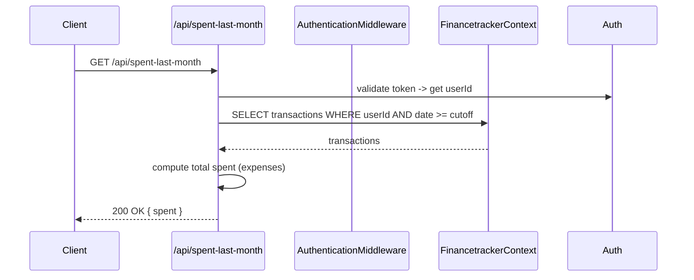

# Spent last month sequence

```mermaid
sequenceDiagram
    participant Client
    participant API as /api/spent-last-month
    participant AuthenticationMiddleware
    participant Db as FinancetrackerContext

    Client->>API: GET /api/spent-last-month
    API->>Auth: validate token -> get userId
    API->>Db: SELECT transactions WHERE userId AND date >= cutoff
    Db-->>API: transactions
    API->>API: compute total spent (expenses)
    API-->>Client: 200 OK { spent }

```
