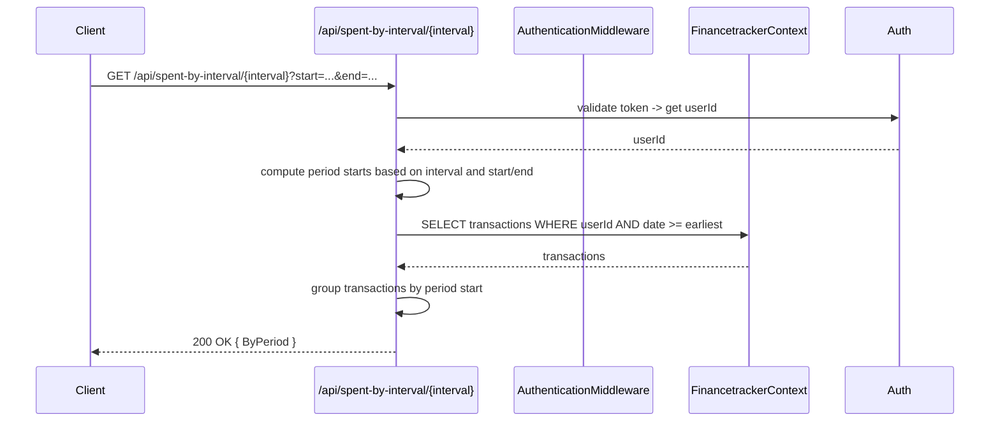

# Statistics: spent by interval sequence

```mermaid
sequenceDiagram
    participant Client
    participant API as /api/spent-by-interval/{interval}
    participant AuthenticationMiddleware
    participant Db as FinancetrackerContext

    Client->>API: GET /api/spent-by-interval/{interval}?start=...&end=...
    API->>Auth: validate token -> get userId
    Auth-->>API: userId
    API->>API: compute period starts based on interval and start/end
    API->>Db: SELECT transactions WHERE userId AND date >= earliest
    Db-->>API: transactions
    API->>API: group transactions by period start
    API-->>Client: 200 OK { ByPeriod }

```
