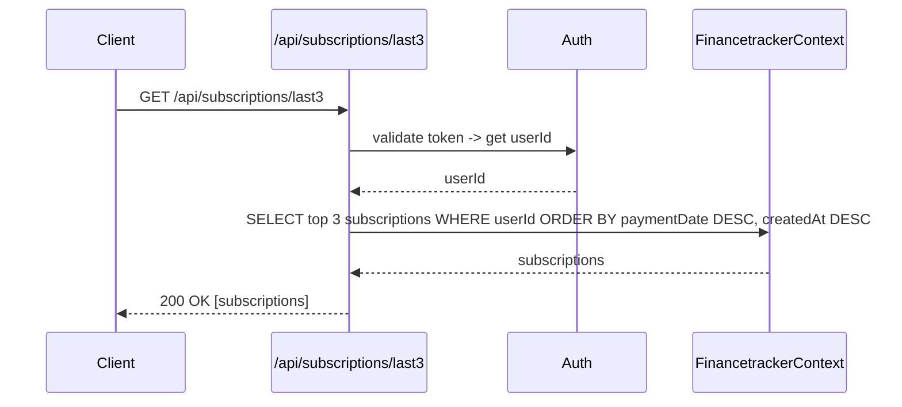

# Subscriptions last3 sequence

```mermaid
sequenceDiagram
    participant Client
    participant API as /api/subscriptions/last3
    participant Auth
    participant Db as FinancetrackerContext

    Client->>API: GET /api/subscriptions/last3
    API->>Auth: validate token -> get userId
    Auth-->>API: userId
    API->>Db: SELECT top 3 subscriptions WHERE userId ORDER BY paymentDate DESC, createdAt DESC
    Db-->>API: subscriptions
    API-->>Client: 200 OK [subscriptions]

```
