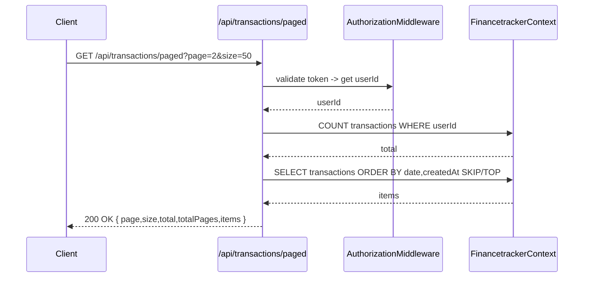

# Get paged transactions sequence

```mermaid
sequenceDiagram
    participant Client
    participant API as /api/transactions/paged
    participant Auth as AuthorizationMiddleware
    participant Db as FinancetrackerContext

    Client->>API: GET /api/transactions/paged?page=2&size=50
    API->>Auth: validate token -> get userId
    Auth-->>API: userId
    API->>Db: COUNT transactions WHERE userId
    Db-->>API: total
    API->>Db: SELECT transactions ORDER BY date,createdAt SKIP/TOP
    Db-->>API: items
    API-->>Client: 200 OK { page,size,total,totalPages,items }

```
