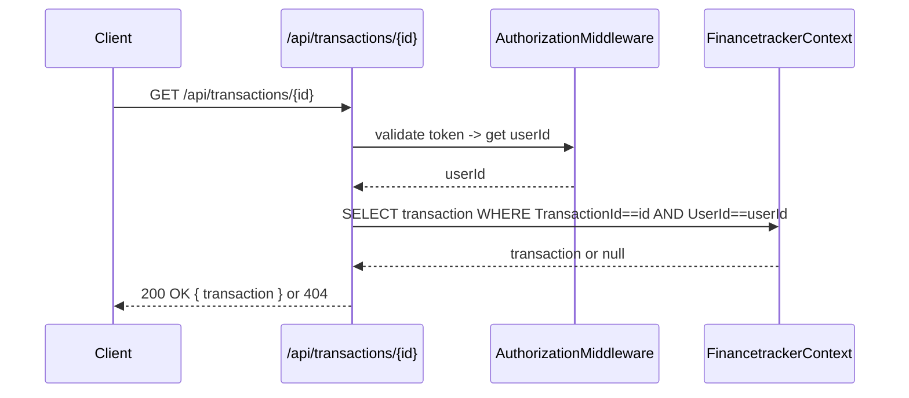

# Get transaction by id sequence

```mermaid
sequenceDiagram
    participant Client
    participant API as /api/transactions/{id}
    participant Auth as AuthorizationMiddleware
    participant Db as FinancetrackerContext

    Client->>API: GET /api/transactions/{id}
    API->>Auth: validate token -> get userId
    Auth-->>API: userId
    API->>Db: SELECT transaction WHERE TransactionId==id AND UserId==userId
    Db-->>API: transaction or null
    API-->>Client: 200 OK { transaction } or 404

```
