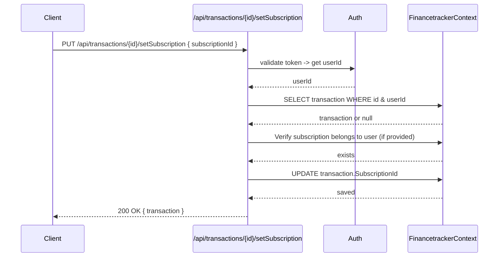

# Set transaction subscription sequence

```mermaid
sequenceDiagram
    participant Client
    participant API as /api/transactions/{id}/setSubscription
    participant Auth
    participant Db as FinancetrackerContext

    Client->>API: PUT /api/transactions/{id}/setSubscription { subscriptionId }
    API->>Auth: validate token -> get userId
    Auth-->>API: userId
    API->>Db: SELECT transaction WHERE id & userId
    Db-->>API: transaction or null
    API->>Db: Verify subscription belongs to user (if provided)
    Db-->>API: exists
    API->>Db: UPDATE transaction.SubscriptionId
    Db-->>API: saved
    API-->>Client: 200 OK { transaction }

```
