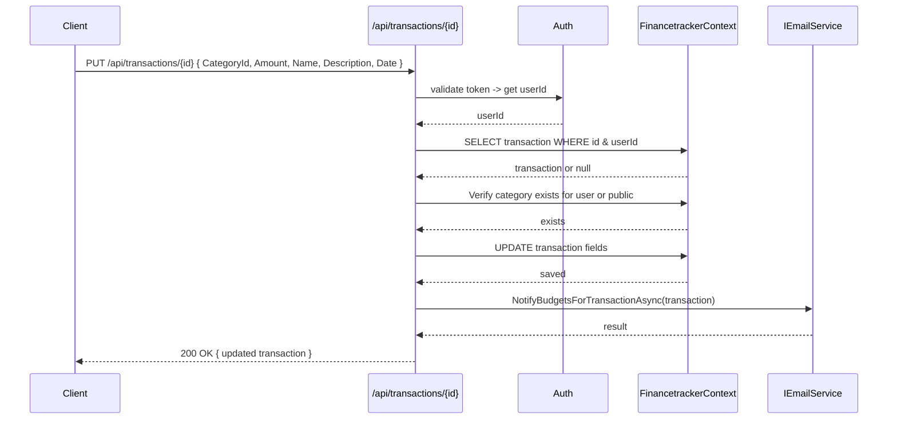

# Update transaction sequence

```mermaid
sequenceDiagram
    participant Client
    participant API as /api/transactions/{id}
    participant Auth
    participant Db as FinancetrackerContext
    participant Email as IEmailService

    Client->>API: PUT /api/transactions/{id} { CategoryId, Amount, Name, Description, Date }
    API->>Auth: validate token -> get userId
    Auth-->>API: userId
    API->>Db: SELECT transaction WHERE id & userId
    Db-->>API: transaction or null
    API->>Db: Verify category exists for user or public
    Db-->>API: exists
    API->>Db: UPDATE transaction fields
    Db-->>API: saved
    API->>Email: NotifyBudgetsForTransactionAsync(transaction)
    Email-->>API: result
    API-->>Client: 200 OK { updated transaction }

```
