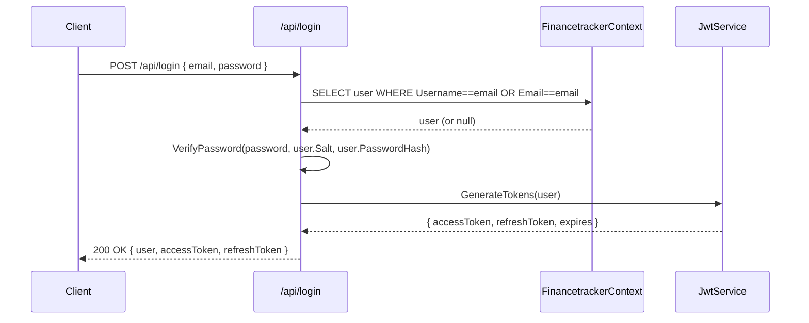
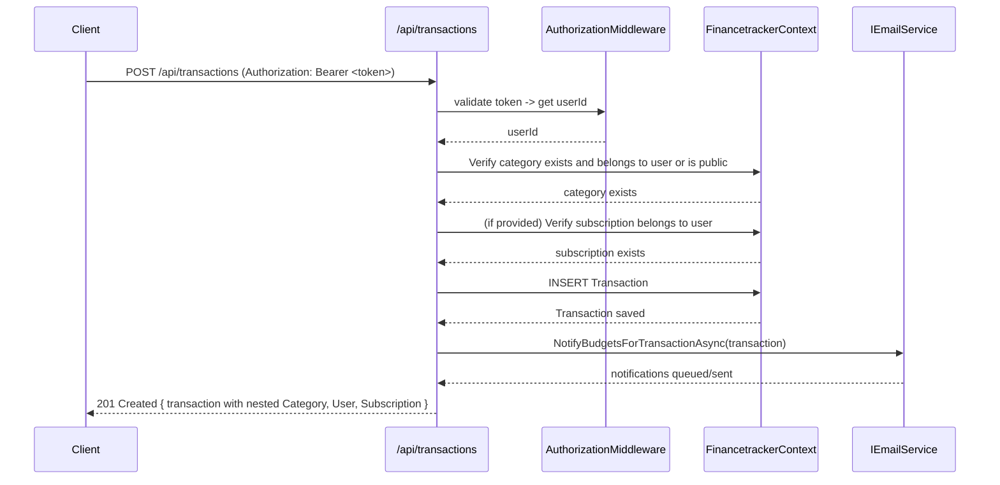
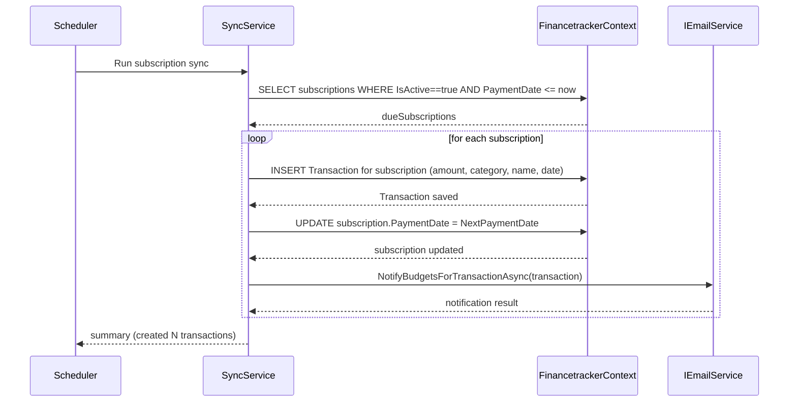

## FinanceTracker UML diagrams (Mermaid)

This file contains Mermaid class diagrams generated from the backend model classes and key services. Paste the Mermaid blocks into a Markdown renderer that supports Mermaid (for example VS Code Markdown preview with Mermaid enabled or GitHub if supported) to visualize the diagrams.

---

### Split class diagrams

For easier navigation the class diagrams are split into three files:

- `docs/models_class_diagrams.md` — models and relationships (User, Category, Budget, Transaction, Subscription, etc.)
- `docs/services_class_diagrams.md` — services and helpers (JwtService, ReportService, Email, BudgetHelpers, HttpContextExtensions)
- `docs/apis_class_diagrams.md` — API/controller class mappings (LoginApi, TransactionsApi, BudgetsApi, etc.)

Open those files to view the Mermaid diagrams separately. The rest of this document keeps notes and sequence diagrams.

---

### Notes & rendering

- File path: `docs/uml_diagrams.md`
- The diagrams are simplified to show main properties and relationships important for understanding structure and associations. They intentionally omit some EF Core mapping details (indexes, column names, constraints) to keep diagrams readable.
- If you'd like separate diagrams for APIs (files under `backend/apis`) or sequence diagrams for common flows (login, create transaction, run subscription sync), tell me which endpoints to include and I will add them.

---

Generated on: 2025-11-03

---

### APIs (controllers)

```mermaid
classDiagram
    %% API mappings (minimal method names reflect routes)
    class LoginApi { +POST /api/login : LoginUser }
    class RegisterApi { +POST /api/register : RegisterUser }
    class NewTokenApi { +POST /api/auth/refresh : RefreshToken }
    class LogoutApi { +POST /api/logout : LogoutUser }
    class TransactionsApi {
      +POST /api/transactions : AddTransaction
      +GET /api/transactions : GetTransactions
      +GET /api/transactions/{id} : GetTransactionById
      +GET /api/transactions/paged : GetPagedTransactions
      +DELETE /api/transactions/{id} : DeleteTransaction
      +PUT /api/transactions/{id} : UpdateTransaction
      +PUT /api/transactions/{id}/setSubscription : SetTransactionSubscription
      +GET /api/transactions/last3 : GetLast3Transactions
    }
    class SubscriptionsApi { +GET /api/subscriptions : GetSubscriptions\n+    +GET /api/subscriptions/last3 : GetLast3Subscriptions }
    class BudgetsApi {
      +POST /api/budgets : AddBudget
      +GET /api/budgets : GetBudgets
      +GET /api/budgets/{id} : GetBudgetById
      +GET /api/budgets/{id}/status : GetBudgetStatus
      +GET /api/budgets/{id}/transactions : GetBudgetTransactions
      +GET /api/budgets/status : GetAllBudgetsStatus
      +PUT /api/budgets/{id} : UpdateBudget
      +DELETE /api/budgets/{id} : DeleteBudget
    }
    class CategoriesApi {
      +POST /api/categories : AddCategory
      +GET /api/categories : GetCategories
      +GET /api/categories/{id} : GetCategoryById
      +PUT /api/categories/{id} : UpdateCategory
      +DELETE /api/categories/{id} : DeleteCategory
    }
    class UserApi { +GET /api/user : GetCurrentUser\n+    +PUT /api/user : UpdateCurrentUser }
    class ReportsApi { +GET /api/reports/budgets : GenerateBudgetReport }
    class SpentThisMonthApi { +GET /api/spent-last-month : GetSpentLastMonth }

    %% dependencies / relationships
    LoginApi ..> FinancetrackerContext : reads Users
    RegisterApi ..> FinancetrackerContext : writes Users
    NewTokenApi ..> JwtService : validate/issue
    TransactionsApi ..> FinancetrackerContext : reads/writes Transactions/Categories/Subscriptions
    TransactionsApi ..> IEmailService : notify budgets
    SubscriptionsApi ..> FinancetrackerContext : reads Subscriptions
    BudgetsApi ..> BudgetHelpers : uses
    ReportsApi ..> ReportService : generates PDF

```

---

### Sequence diagrams (common flows)

#### Login



#### Create transaction (POST /api/transactions)



#### Subscription sync (background job)



---

If you want, I can:

- Add an extra file `docs/api_diagrams.md` instead of appending here.
- Generate per-endpoint sequence diagrams (e.g., UpdateTransaction, DeleteTransaction).
- Convert the subscription sync sequence into runnable pseudocode or an implementation sketch if you want a background worker.

Generated on: 2025-11-03
